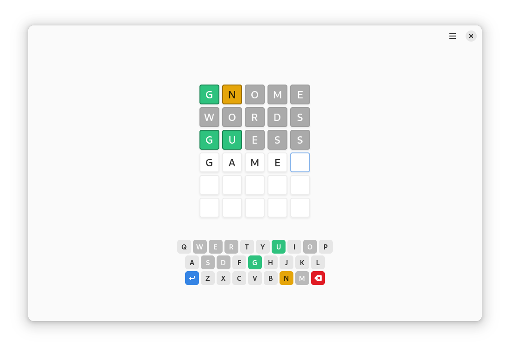

<p align="center">
  
</p>

<h1 align="center">Blurble</h1>

<p align="center"><strong>Word guessing game</strong></p>

<p align="center">
  <a href="https://flathub.org/apps/details/app.drey.Blurble">
    
  </a>
</p>

<p align="center">
  
</p>

<p align="center">
  <a href="https://stopthemingmy.app">
    
  </a>
  <a href="https://liberapay.com/pervoj">
    
  </a>
  <a href="https://ko-fi.com/pervoj">
    
  </a>
  <a href="https://www.paypal.com/donate/?hosted_button_id=7P3BD55QX6B9J">
    
  </a>
</p>

<!--
[](https://stopthemingmy.app)
[](https://liberapay.com/pervoj)
[](https://ko-fi.com/pervoj)
[](https://www.paypal.com/donate/?hosted_button_id=7P3BD55QX6B9J)
-->

---

Solve the riddle until you run out of guesses!

The game is a clone of Wordle and made with localization in mind.

## ⚙️ Installing

### Stable and beta

Both release channels, stable and beta, are available from Flathub.

For stable releases:

```sh
flatpak remote-add --if-not-exists flathub https://flathub.org/repo/flathub.flatpakrepo
flatpak install flathub app.drey.Blurble
```

For beta releases:

```sh
flatpak remote-add --if-not-exists flathub-beta https://flathub.org/beta-repo/flathub-beta.flatpakrepo
flatpak install flathub-beta app.drey.Blurble
```

### Building from source

There are two options how to do it:

- Run the app from [GNOME Builder](https://flathub.org/apps/details/org.gnome.Builder)
- Use the following commands to build it with Meson:

```sh
meson _build
sudo meson install -C _build
```

## 👥 Contributing

I'm happy to see you in this chapter! If you are interested in this project,
I would be glad for any help with development, design and translations.

For more info about contributing please read [this guide](CONTRIBUTING.md).
